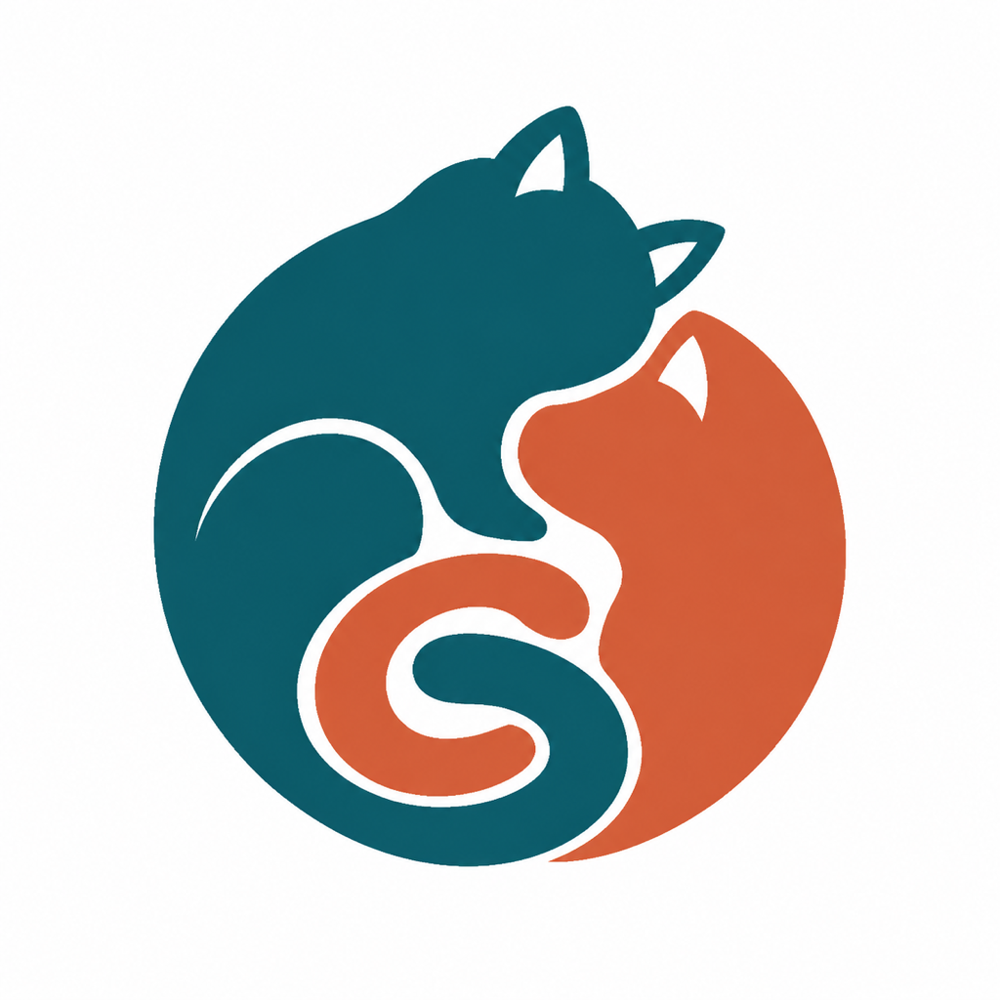

# PetsGraph



PetsGraph 是面向宠物离世纪念场景的开源多宠播放器。主人不需要与宠物互动，只会在桌面固定位置看到熟悉的宠物按照自己的节奏睡觉、换姿、吃饭、舔毛或看向窗外。

核心目标不是动作数量，而是生命感：真实身份、自然承重、缓慢节奏、连续动作和没有卡帧、闪动或硬切的长期陪伴。

## 当前状态

`v1.0.0` 是新架构的首个正式 Player 版本。PetPack 1.0 的公开 schema、参考验证器、合成夹具和安全回归已经实现。Apple Silicon macOS 与 Windows x64 均支持原生 PetPack 校验、canonical 宠物库、被动行为会话、固定舞台、多宠窗口和目标菜单，两个发布包都不包含真实宠物素材。macOS 已完成卸载重装、显示隐藏、菜单灰显、Dock 区域拖出、四边贴靠、七档全局大小、重启保持、透明点击穿透、正常速度动作和双宠长期资源验收。Windows x64 已完成 45 项测试、零警告构建、AMD64 PE、零素材 ZIP 和 PetPack 原生校验；本轮没有新增真实 Windows GUI 人工复验，具体边界见发布说明。

历史 `v0.6.0` 仍保留为旧双宠架构回滚版本：

- Apple Silicon macOS 与 Windows 11 x64。
- 安装包内嵌五百和飞流。
- 使用旧 `.petsgraph-pet` schema `0.4.0`。
- 仍包含点击坐立、指定睡姿和历史 root motion 能力。

这些历史发布物继续可用并作为迁移基线，但不代表 `v1.0.0` 仍保留上述交互。

[下载 Windows x64 v1.0.0](https://github.com/iyuenan3/petsgraph/releases/download/v1.0.0/PetsGraph-v1.0.0-Windows-x64.zip) · [下载 Apple Silicon macOS v1.0.0](https://github.com/iyuenan3/petsgraph/releases/download/v1.0.0/PetsGraph-v1.0.0-macOS-arm64.dmg) · [查看 v1.0.0 发布说明](docs/releases/v1.0.0.md)

## 下一代产品结构

```text
私有 PetsGraph Studio
  客户资料、Seedance、抠图、评审、PetPack 编译
                      ↓
              客户自持 .petpack
                      ↓
公开 PetsGraph Player
  装载、校验、播放、显示隐藏、卸载、统一大小
```

### PetsGraph Player

- 免费、开源、离线运行。
- 发布包不包含任何真实宠物素材。
- 支持同时装载多只宠物。
- 每只宠物有独立动作图、独立时钟、固定位置和自己的基础体型。
- 所有宠物共享 `0.5` 至 `2.0` 全局大小。
- 不提供点击动作、睡姿选择、宠物任务或窗口随步行移动。
- 当前只计划实现 Apple Silicon macOS 与 Windows x64。

### `.petpack`

- 一包一宠，支持猫和狗。
- 是客户付费定制并自行长期保存的数字纪念作品。
- 包含最终连续视频、动作图、行为配置、基础体型和完整性信息。
- 文件采用公开 ZIP 容器并使用 `.petpack` 扩展名；PetPack 1.0 把现有固定裁剪预乘 RGBA 连续帧作为长期兼容媒体表示。
- 不包含原始照片、提示词、脚本、provider 凭据或在线授权。
- 装载后 Player 使用内部副本，用户可以把原始文件移到云盘或移动硬盘。
- 卸载会删除 Player 内部副本，再次使用需要原始 `.petpack`。
- 格式保持平台无关，为未来 iPadOS 和电视端 Player 保留兼容性。
- 首个 1.0 只提供完整性哈希，不接受官方签名；签名以后通过显式新格式作为来源证明增加，不能让已经交付的 1.0 包失效。

### 私有制作系统

客户提供宠物生前照片、视频和习惯资料。正式制作路线为：

```text
身份母版
  → Seedance 原生慢速连续视频
  → 未抠图完整动作链正常速度验收
  → 整段背景色族抠图
  → 固定几何与透明边缘验收
  → 双平台 PetPack 验收
```

正式动作不使用骨骼、精灵图、RIFE、光流、自动补间、跨节点倒放或交叉淡化。播放器也不会用硬切和补帧修补不合格素材。

Seedance、Seedream、GPT Image 制作工具、提示词、客户资料、未公开母片和未来正式 PetPack 属于私有 Studio，不属于开源 Player 的公开仓库边界。历史制作工具、宠物事实源、旧包工作区和 Codex 私有重建记录已经迁入根 Git 忽略的职责目录，同时保留其历史与原有限定授权。

`studio/` 是根公开 Git 完整忽略的本机私有目录，不创建单独 Git 仓库。五百与飞流已经使用批准的 `cropped-rgba-clips` 媒体离线转换为 PetPack 1.0 候选，旧交互节点、交互边和窗口 root motion 不进入新契约。候选包仍等待新 Player 双平台真实桌面验收，不能提前作为正式交付。小葵当前只整理已有资料，本轮不继续生成、抠图或制作 PetPack。

## 目标菜单

```text
装载宠物包…

显示宠物
  全部
  <每只已装载宠物>

隐藏宠物
  全部
  <每只已装载宠物>

卸载宠物
  全部
  <每只已装载宠物>

大小
  0.5 至 2.0

关于 PetsGraph
退出 PetsGraph
```

隐藏只暂停显示并保留内部包，适用于会议投屏。卸载会删除 Player 中的宠物，恢复时必须重新装载用户保存的原始 `.petpack`。

下一代 macOS 开发版既可从状态栏选择“装载宠物包…”，也可在访达中直接双击 `.petpack`；两种入口使用同一套校验、原子装载和失败回滚逻辑。

## v1.0.0 安装

### Windows 11 x64

1. 下载并完整解压 `PetsGraph-v1.0.0-Windows-x64.zip`。
2. 不要只把 `PetsGraph.exe` 拖出目录，self-contained 运行文件必须保持在同一目录。
3. 双击 `PetsGraph.exe`，然后从系统托盘装载 `.petpack`。当前版本没有代码签名，可能出现 SmartScreen 提示。
4. 发布物不包含五百、飞流或其他宠物，宠物包需要单独获得并自行长期保存。

下一代 Windows 开发版说明见 [`player/windows/README-Windows.md`](player/windows/README-Windows.md)。

### Apple Silicon macOS

1. 下载并打开 `PetsGraph-v1.0.0-macOS-arm64.dmg`。
2. 把 `PetsGraph.app` 拖入“应用程序”。
3. 当前版本使用 ad-hoc 签名、没有 Apple 公证。首次启动如被阻止，在 Finder 中右键选择“打开”，或在“系统设置 > 隐私与安全性”确认。
4. 从状态栏菜单装载 `.petpack`，也可以在访达中直接双击 `.petpack`。

两个附件的精确字节数和 SHA-256 记录在 [`release/manifests/v1.0.0.json`](release/manifests/v1.0.0.json)。

## 当前仓库结构与目标目录

下一代目录迁移已经完成。Codex 公开包、Player 平台源码、私有 Studio、宠物事实源、旧包和本地产物均已完成路径切换。macOS 与 Windows 都已切入 PetPack 1.0 开发实现：

- `player/macos/Sources/PetsGraphV1Core/`：PetPack 1.0 原生 ZIP、完整性、canonical 库、独立时钟和持久状态核心。
- `player/macos/Sources/PetsGraphV1App/`：零素材 AppKit Player、固定透明舞台、拖动与目标菜单。
- `player/windows/src/PetsGraph.Core/`：PetPack 1.0 原生 ZIP、完整性、canonical 库、独立时钟、持久状态和 RGBA 到 PBGRA 渲染核心。
- `player/windows/src/PetsGraph.App/`：零素材 Windows x64 WPF Player、固定透明舞台、拖动与目标托盘菜单。
- `studio/`：本机私有制作工具、provider 配置和环境模板，整个目录被根 Git 忽略，不存在于公开 clone。
- `pets/`：本机私有宠物唯一事实源，保存参考资料、批准素材和生产履历。
- `petpacks/`：本机私有旧包、PetPack 转换工作区和交付记录，不作为原始资料事实源。
- `codexpets/packages/public/`：当前五百与飞流的 Codex v2 小型图集导出，不是 PetsGraph 连续视频 PetPack。
- `.local/`：本机缓存、虚拟环境、构建候选和已发布附件的可下载副本。
- `AIREADME/`：产品、架构、PetPack 契约、迁移与发布真相源。

目标仍以本仓库为整个项目唯一根目录，收敛为 `player/`、`petpack/`、`studio/`、`pets/`、`petpacks/`、`codexpets/` 与 `.local/`。其中 Player 子树和安装包不包含真实宠物素材；单独授权的 Codex 公开图集可以保存在 `codexpets/packages/public/`。详细职责、根 Git 跟踪范围和安全迁移门禁见 [`AIREADME/DIRECTORY.md`](AIREADME/DIRECTORY.md)。

## 当前开发验证

PetPack 1.0：

```bash
python3 -m petpack.validator petpack/fixtures/synthetic-cat-v1.petpack
python3 -m petpack.validator petpack/fixtures/synthetic-cat-forward-v1.petpack
python3 -m unittest discover -s petpack/tests -v
```

两个公开夹具都只包含程序生成的 2×2 RGBA 像素，不具有真实宠物身份。基线包验证完整契约，前向兼容包额外证明未知可选能力会被忽略、缺省动作权重按 `1.0` 处理。验证器先检查 ZIP 路径、压缩和大小预算，再检查完整性、固定舞台、动作图、被动行为与媒体长度。

Swift：

```bash
bash player/macos/scripts/test.sh
python3 player/macos/scripts/build-app.py \
  --output .local/dist/builds/PetsGraph-1.0.0.app \
  --version 1.0.0 \
  --build-number 19
```

Windows 核心与 WPF：

```bash
DOTNET_CLI_HOME=/tmp/petsgraph-dotnet-home ~/.dotnet/dotnet test player/windows/tests/PetsGraph.Core.Tests/PetsGraph.Core.Tests.csproj -c Release
DOTNET_CLI_HOME=/tmp/petsgraph-dotnet-home ~/.dotnet/dotnet build player/windows/PetsGraph.slnx -c Release
```

Swift 与 Windows 命令分别验证两个 `1.0.0` Player 的 PetPack 1.0 原生装载、canonical 库、行为状态机和零素材构建。自动化与跨平台打包不替代真实桌面人工观看，平台验收边界见 [`docs/releases/v1.0.0.md`](docs/releases/v1.0.0.md)。

2026-08-23 的逐项重构证据、开发产物摘要和人工门禁见 [`docs/audits/refactor-2026-08-23.md`](docs/audits/refactor-2026-08-23.md)。

## Codex 宠物导出

仓库另行维护五百和飞流的 Codex v2 自定义宠物图集：

```bash
python3 codexpets/tools/manage.py validate
python3 codexpets/tools/manage.py install
```

它们是 Codex 专用小型图集，不属于 PetsGraph Player 的连续视频路线，也不继承 PetPack 的动作图和生命感批准。

公开包、公开清单和管理工具已经一次性切换到 `codexpets/`。原 `codex-pets/` 和 `tools/manage-codex-pets.py` 不再作为兼容入口。

## License

公开 Player、PetPack 验证器和 Codex 管理工具使用 [MIT License](LICENSE)。私有 Studio、五百与飞流历史公开素材、Codex 图集和未来客户 `.petpack` 不自动采用 MIT，具体边界见 [ASSETS.md](ASSETS.md) 与对应交付约定。
